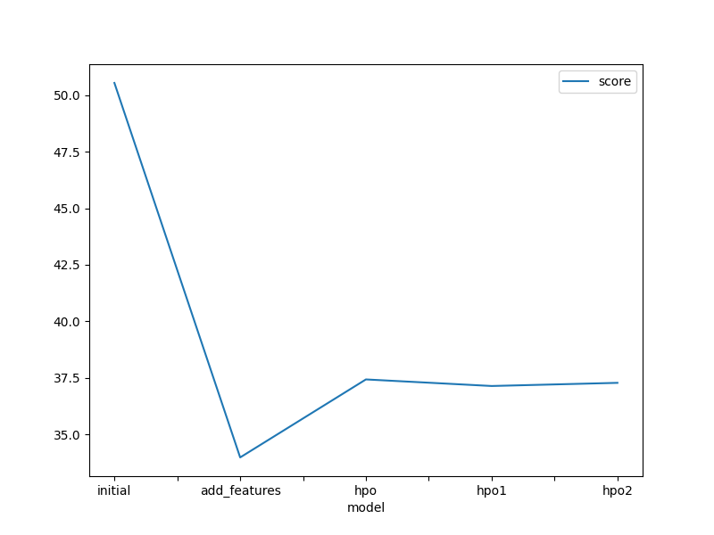
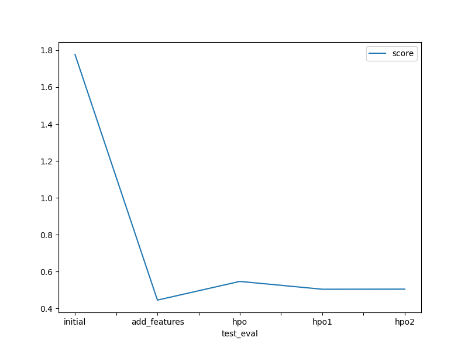

# Report: Predict Bike Sharing Demand with AutoGluon Solution

#### Anubhav De

## Initial Training

### What did you realize when you tried to submit your predictions? What changes were needed to the output of the predictor to submit your results?

**Five different experiments were performed as follows:**

1. Initial Raw Submission **[Model: `initial`]**
2. Added Features Submission _(EDA + Feature Engineering)_ **[Model: `add_features`]**
3. Hyperparameter Optimization (HPO) - Initial Setting Submission
4. Hyperparameter Optimization (HPO) - Setting 1 Submission
5. Hyperparameter Optimization (HPO) - Setting 2 Submission **[Model: `hpo (top-hpo-model: hpo2)`]**

**Observation:** Some of the trials had negative prediction values after inputting the results of all five experiments.
 

### What was the top ranked model that performed?

The `top-ranked model` was the `(add features) model` named `WeightedEnsemble_L3`, with a **validation RMSE score** of **37.9800** and the best **Kaggle score** of **0.44798 (on test dataset)**. Without employing a hyperparameter optimization process, this model was created by training on data that was gathered through exploratory data analysis (EDA) and feature engineering. Some models did exhibit increased RMSE scores on validation data after hyperparameter adjustment, however this model performed the best on an unknown test dataset. The decision was made after taking into account the RMSE (cross-validation) and Kaggle (test data) scores, as several models offered competitive performance.

## Exploratory data analysis and feature creation

### What did the exploratory analysis find and how did you add additional features?

- Feature `datetime` was parsed as a datetime feature to obtain hour information from timestamp
- Independent features `season` and `weather` were initially read as `integer`. Since these are categorical variables, they were transformed into `category` data type.
- The data for `year`, `month`, `day` _(dayofweek)_ and `hour` were extracted as distinct independent features from the `datetime` feature using feature extraction. Upon feature extraction, `datetime` feature was dropped.
- After probing and considering the features, `casual` and `registered`, it was noticed that the RMSE scores improved significantly during cross-validation and these independent features were highly co-related to the target variable `count`. However, the features `casual` and `registered` are only present in the train dataset and absent in the test data; hence, these features were ignored/dropped during model training
- Another categorical feature `day_type` was added based on `holiday` and `workingday` feature. It was defined to effectively segregate "weekday", "weekend" and "holiday" categories.
- Moreover, features `temp` (temperature in degree Celsius) and `atemp` (_'feels like'_ temperature in degree Celsius) had a `high positive correlation of 0.98`. Hence, in order to reduce multicollinearity between independent variables, `atemp` was dropped from the train and test datasets respectively.
- Further, data visualization was conducted to derive insights from the features.

### How much better did your model perform after adding additional features and why do you think that is?

- In comparison to the initial/raw model performance (without EDA and/or feature engineering), the inclusion of extra features `improved model performance by approximately 138%.`
- Certain category variables having `integer` data types were changed into their real `categorical` data types, which enhanced the model performance.
- Even `atemp` was removed from the datasets because to its strong correlation with another independent variable `temp`, in addition to disregarding `casual` and `registered` characteristics during model training. This made multicollinearity lessened.
- Additionally, the model performance was enhanced by dividing the `datetime` feature into numerous independent features, such as `year`, `month`, `day`, and `hour`, as well as by the addition of `day_type`, because these predictor variables `aid the model assess seasonality or historical patterns in the data` more effectively.

## Hyper parameter tuning

### How much better did your model preform after trying different hyper parameters?

The performance of the model was improved over the model's original submission thanks to hyperparameter adjustment. Hyperparameter optimization tests were conducted using three distinct setups. The model with EDA and extra features performed significantly better on the Kaggle (test) dataset, despite hyperparameter optimized models delivering competitive performances in comparison.

**Observations:**

- The autogluon package was used for training while taking into mind the recommended parameters. However, because the hyperparameters are tuned with a predetermined set of values provided by the user, limiting the alternatives autogluon may explore, the performances of hyperparameter optimized models were sub-optimal.
- The 'time_limit' and 'presets' arguments are also very important when using autogluon to optimize hyperparameters.
- If the time restriction is too short for the models to be constructed, Autogluon may not be able to build any models for a specified set of hyperparameters to be tweaked.
- Additionally, hyperparameter optimization with settings like "high_quality" (with auto_stack enabled) uses a lot of memory and is computationally demanding for the allotted amount of time with the resources provided. As a result, experiments were conducted with predefined choices like "medium_quality" and "optimized_for_deployment" that are lighter and quicker. As the other presets failed to generate models using AutoGluon for the experimental settings, I picked the quicker and lighter preset "optimize_for_deployment" for the hyperparameter optimization method.
- `Exploration vs exploitation` is the biggest challenge while using AutoGluon with a prescribed range of hyperparameters.

### If you were given more time with this dataset, where do you think you would spend more time?

If I had more time to work with this dataset, I would like to explore other outcomes that could occur when AutoGluon is run for a prolonged length of time with a high-quality preset and improved hyperparameter tuning.

### Create a table with the models you ran, the hyperparameters modified, and the kaggle score.

| model                     | hpo1                                   | hpo2              | hpo3                                        | score   |
| ------------------------- | -------------------------------------- | ----------------- | ------------------------------------------- | ------- |
| initial                   | prescribed_values                      | prescribed_values | "presets: 'high quality' (auto_stack=True)" | 1.77759 |
| add_features              | prescribed_values                      | prescribed_values | "presets: 'high quality' (auto_stack=True)" | 0.44538 |
| hpo (top-hpo-model: hpo2) | Tree-Based Models: (GBM, XT, XGB & RF) | KNN               | "presets: 'optimize_for_deployment"         | 0.50485 |

### Create a line plot showing the top model score for the three (or more) training runs during the project.

### Create a line plot showing the top kaggle score for the three (or more) prediction submissions during the project.

## Summary

This bike sharing demand forecast project has carefully examined and included the AutoGluon AutoML framework for Tabular Data.

- To create automated stack ensembled as well as individually different configurable regression models trained on tabular data, the AutoGluon framework's capabilities were fully tapped. It made it easier to quickly prototype a foundational model.
- By integrating data from rigorous exploratory data analysis (EDA) and feature engineering without hyperparameter tweaking, the top-ranked AutoGluon-based model greatly improved results.
- AutGluon was able to investigate and take advantage of the best potential possibilities by utilizing automatic hyperparameter tuning, model selection/ensembling, and architectural search.
- Additionally, AutoGluon's hyperparameter tuning offered performance gains over the first raw submission, but they fell short of the model's performance with EDA, feature engineering, and no hyperparameter tuning.
- It was discovered that tuning hyperparameters with AutoGluon (without default hyperparameters or random parameter configuration) is a laborious procedure that is greatly influenced by the time allotted, the presets that have been prescribed, the potential model family, and the range of hyperparameters to be adjusted.
